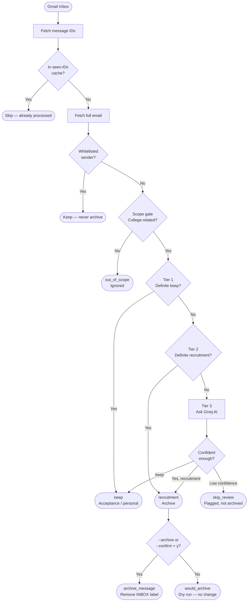

# Sweep

A Python CLI tool that scans your Gmail inbox, identifies college recruitment spam using a tiered rule + AI classifier, and archives it — without ever deleting a single email.

---

## What it does

College admissions offices send hundreds of mass-recruitment emails. Sweep automatically identifies them and removes them from your inbox, while keeping real emails (acceptances, financial aid, personal messages) untouched.

- **Never deletes email** — archives only (removes the `INBOX` label, email stays in All Mail and is fully recoverable)
- **Tiered classifier** — tries cheap keyword rules first, only calls an AI when rules can't decide
- **Safe by default** — dry run unless you explicitly pass `--confirm` or `--archive`
- **Whitelist** — specific senders you never want touched, regardless of content
- **Seen-IDs cache** — skips already-processed emails on repeat runs, no re-scanning

---

## How it works



### The three tiers

| Tier | Method | When it fires |
|---|---|---|
| **Scope gate** | Keyword rules | Runs first. If the email has no college signals at all, it's ignored immediately. |
| **Tier 1 — Keep** | Keyword rules | Phrases like "congratulations" or "your application has been received" — only appear post-application. |
| **Tier 2 — Recruitment** | Keyword rules | Phrases like "campus tour", "students like you", or a known marketing platform in the sender. 100% confident. |
| **Tier 3 — Groq** | Llama 3.1 8B (free) | Everything else that passed the scope gate. Returns a confidence score; below 80% it's flagged for review instead of archived. |

---

## Tech stack

- **Python 3** — no framework
- **Gmail API** (google-api-python-client) — read labels, modify labels, send mail
- **Google OAuth 2.0** — `gmail.modify` scope; cannot permanently delete
- **Groq** — free-tier Llama 3.1 8B for ambiguous classification
- **tqdm** — progress bar
- **rich** — colored terminal tables

---

## Setup

### 1. Clone and install dependencies

```bash
git clone https://github.com/YOUR_USERNAME/sweep.git
cd sweep
pip install -r requirements.txt
```

### 2. Get a Groq API key

Sign up at [console.groq.com](https://console.groq.com) (free). Create a key and add it to a `.env` file:

```
GROQ_API_KEY=your_key_here
```

### 3. Set up Gmail API credentials

1. Go to [Google Cloud Console](https://console.cloud.google.com)
2. Create a project → Enable the Gmail API
3. Create OAuth credentials (Desktop app) → Download as `credentials.json`
4. Place `credentials.json` in the project root

### 4. Authenticate

```bash
python auth.py
```

Opens a browser tab for Gmail login. Saves `token.json` so future runs are silent.

---

## Usage

```bash
# Preview — shows what would be archived, changes nothing
python sweep.py --max 50

# Recommended: preview first, then prompt to confirm
python sweep.py --max 50 --confirm

# Archive immediately with no prompt
python sweep.py --max 50 --archive

# Archive + send programmatic unsubscribe requests
python sweep.py --max 50 --archive --unsubscribe

# Diagnose why a specific email isn't being caught
python sweep.py --max 20 --debug
```

### Scaling to a large inbox

Sweep caches every processed email in `seen_ids.txt`. On repeat runs it skips already-decided emails instantly, so you can incrementally sweep a large inbox:

```bash
python sweep.py --max 1000 --confirm   # first pass
python sweep.py --max 2000 --confirm   # skips the first ~750 kept emails, goes deeper
python sweep.py --max 3000 --confirm   # and so on
```

---

## Configuration

### Whitelist (`whitelist.txt`)

Add sender addresses that should never be archived, one per line:

```
# Lines starting with # are comments
noreply@commonapp.org
```

---

## Files

| File | Purpose |
|---|---|
| `auth.py` | Google OAuth — returns a Gmail API service object |
| `classify.py` | Tiered classifier — scope gate → keep rules → recruitment rules → Groq |
| `sweep.py` | Main loop — fetch, classify, archive, log, stats |
| `whitelist.txt` | Senders that are never archived |
| `requirements.txt` | Python dependencies |
| `STUDY_GUIDE.md` | Detailed walkthrough of every function with explanations (personal reference) |

---

## Privacy

- Email body content is never written to disk or logged
- `sweep_log.json` records sender, subject, classification label, and confidence only
- `credentials.json` and `token.json` are excluded from version control
